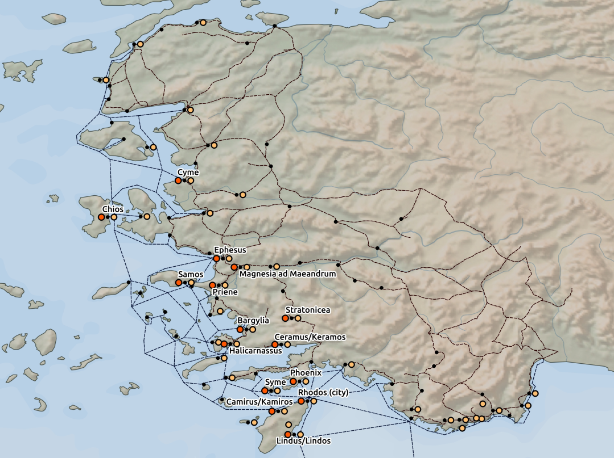

## ISIAC-CULTS IN ASIA MINOR research

This repository is a part of study published by [PLOS One](https://journals.plos.org/plosone/article?id=10.1371/journal.pone.0230733) written by [Tomáš Glomb](https://muni.academia.edu/Tom%C3%A1%C5%A1Glomb), [Adam Mertel](https://adammertel.github.io/cv/), Zdeněk Pospíšil and Aleš Chalupa.

Processing folder consists of four node scripts:

- _base.js_ contains several methods shared across other scripts
- _pois.js_ processes some attributes in data and creates GeoJSON files
- _tobler.js_ contains the auxiliary function to calculate [the Tobler's hiking function](https://en.wikipedia.org/wiki/Tobler%27s_hiking_function)
- _process.js_ is the main script that creates the final table with resulting values

